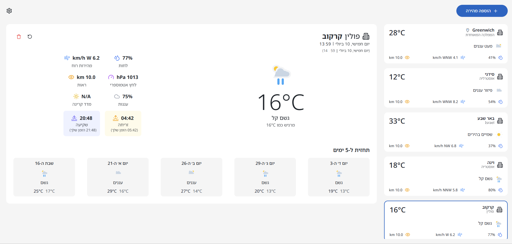

# Weather Next.js – דו־לשונית, רספונסיבית ומותאמת להפקה

> Progressive weather experience for Hebrew & English speakers, powered by Next.js 15, Clerk, Prisma, and real‑time Open‑Meteo data.  
> אפליקציית מזג אוויר מתקדמת בעברית ובאנגלית, מבוססת Next.js 15, Clerk, Prisma ו־Open‑Meteo בזמן אמת.



---

## Contents • תוכן עניינים
- [Overview](#overview--סקירה)
- [Key Features](#key-features--תכונות-עיקריות)
- [Tech Stack](#tech-stack--טכנולוגיות)
- [System Architecture](#system-architecture--ארכיטקטורה)
- [Environment Variables](#environment-variables--משתני-סביבה)
- [Getting Started](#getting-started--התחלה-מהירה)
- [Quality Tooling](#quality-tooling--בדיקות-ואיכות)
- [Project Structure](#project-structure--מבנה-הפרויקט)
- [Troubleshooting](#troubleshooting--פתרון-תקלות)

---

## Overview • סקירה

**EN:** Weather Next.js is a production-grade, bilingual (Hebrew ↔ English) weather dashboard. It ships with secure Clerk authentication, offline-aware PWA hooks, extensive accessibility, and a feature-based architecture that keeps UI, state, and data layers cleanly separated.

**HE:** Weather Next.js היא אפליקציית מזג אוויר מוכנה לפרודקשן, דו־לשונית (עברית ↔ אנגלית), הכוללת אימות משתמשים מאובטח עם Clerk, מנגנוני PWA מודעים לאופליין, נגישות ברמה גבוהה וארכיטקטורה מודולרית המפרידה בין שכבות ה־UI, ה־State וה־Data.

---

## Key Features • תכונות עיקריות

- 🌍 **Full RTL/LTR support** – שינוי שפה מיידי (עברית/אנגלית) עם טיפול מלא בכיווניות ובפורמטי תאריך.  
- 🔐 **Secure bootstrap & caching** – אימות Clerk בצד השרת + שכבת cache ב-Prisma/Open-Meteo לעומסים גבוהים.  
- 📊 **Rich weather insights** – תחזית יומית ושעתית, מדדי UV, נראות, עננות, לחות ורוח – בשפה הנכונה.  
- 🧭 **חיפוש ערים דו־לשוני** – Geoapify + מסד נתונים פנימי מייצרים אובייקט עיר מלא בעברית ובאנגלית.  
- 💠 **Zustand stores per feature** – ניהול State ממוזער, selector-first, למניעת render נוספים.  
- ♿ **WCAG 2.2 AA** – פוקוס, קריאות מסך, aria מתקדמות, בדיקות רגרסיה לאינפוהגליות קריטיות.  
- 📠 **Swipe & Scroll UX** – גלילה אנכית בתוך הכרטיס + החלקה אופקית חלקה לעבור בין ערים.  
- 🔔 **Push Notifications ready** – תשתית VAPID לדחיפת התראות מזג אוויר קריטיות.  
- 🧪 **93%+ coverage** – Vitest + Playwright + Lighthouse (99/100 Performance, 100/100 Accessibility / Best Practices / SEO).

---

## Tech Stack • טכנולוגיות

| Layer | Stack |
| --- | --- |
| **UI & Framework** | Next.js 15 App Router, React 19, TypeScript, TailwindCSS, shadcn/ui (Radix primitives), Framer Motion |
| **State & Data** | Zustand (feature scopes), Prisma 6 (SQLite by default), rate-limiter-flexible, Geoapify + Open-Meteo APIs |
| **Auth & Security** | Clerk (Next.js SDK), HTTPS enforcement via `fetchSecure`, Web Push (VAPID) |
| **Tooling** | Vitest + React Testing Library, Playwright, ESLint, Prettier, Lighthouse CI, Workbox for PWA hooks |

---

## System Architecture • ארכיטקטורה

### Flow at a Glance
1. **Client bootstrap** (`useUserSync`)  
   - Clerk session → `/api/bootstrap`  
   - Prisma hydrates cities, preferences, TTL.  
   - Retry/backoff on token/network issues before redirecting.
2. **Data requests**  
   - `fetchSecure` appends Bearer tokens & HTTPS guard.  
   - `/api/suggest` → DB cache → Geoapify fallback → bilingual normalization.  
   - `/api/weather` → Open-Meteo → Prisma cache (20‑minute TTL).
3. **State orchestration**  
   - `useWeatherStore` memoizes combined state; selectors keep components isolated.  
   - Feature stores (search, notifications, onboarding) encapsulate local logic.
4. **Presentation**  
   - Swipeable card (Framer Motion + gesture heuristics).  
   - Tailwind tokens from `config/tokens.ts` ensure spacing/typography consistency.  
   - A11y-first components (`Dialog`, `ToastHost`, `WeatherTimeNow`) with live regions and keyboard shortcuts.

### מה חשוב לדעת בעברית?
- כל זרימת ה־API עוברת דרך שכבת שירות + ולידציה של Zod.  
- זמני תגובה נשמרים באמצעות caching במסד הנתונים ו־React cache בצד הלקוח.  
- מודל Feature-first: כל Feature (search/weather/settings וכו׳) מחזיק `components/`, `store/`, `services/`, `tests/` משלו.  
- תמיכה מלאה ב־RTL כולל גלילה, אינטראקציות ומעברי ערים עם החלקה.

---

## Environment Variables • משתני סביבה

Create `.env.local` (or set secrets in your deployment) with:

| Variable | Required | Description |
| --- | --- | --- |
| `NEXT_PUBLIC_CLERK_PUBLISHABLE_KEY` | ✅ | Clerk frontend key for authenticating users. |
| `CLERK_SECRET_KEY` | ✅ | Clerk backend key used in API routes & bootstrap. |
| `GEOAPIFY_KEY` | ✅ | Geoapify API key for bilingual city autocomplete + reverse geocode. |
| `DATABASE_URL` | ✅ (prod) | Prisma connection string (`file:./dev.db` for local SQLite). |
| `NEXT_PUBLIC_APP_URL` | ⬜ | Base URL for notifications/tests (`http://localhost:3000` default). |
| `NEXT_PUBLIC_VAPID_PUBLIC_KEY`, `VAPID_PUBLIC_KEY`, `VAPID_PRIVATE_KEY` | ⬜ | Web Push keys (generate via `npx web-push generate-vapid-keys`). |
| `NEXT_PUBLIC_APP_VERSION` | auto | Filled automatically by `npm run build` (see `set-version` script). |

> ⚠️ Without a valid Clerk session or Geoapify key the bootstrap/lookup flows will fail (you’ll see the toast + console error).  
> ⚠️ ללא מפתחות Clerk ו־Geoapify תקינים, זרימות זיהוי וחיפוש ייכשלו.

---

## Getting Started • התחלה מהירה

```bash
# 1. Clone
git clone https://github.com/your-org/weather-next-js.git
cd weather-next-js

# 2. Install
npm install

# 3. Configure environment
cp .env.example .env.local   # (create & fill according to table above)

# 4. Prisma (first run only)
npx prisma generate
npx prisma db push          # or prisma migrate deploy (production)

# 5. Start dev server
npm run dev
```

### Useful Scripts
- `npm run lint` – ESLint across TS/TSX.
- `npm run test` – Vitest (unit + integration) in watch mode.
- `npm run test:coverage` – Vitest with V8 coverage.
- `npm run e2e` / `npm run e2e:ui` – Playwright.
- `npm run build` → `npm run start` – Production build.
- `npm run prisma:studio` – Inspect/edit database records.

---

## Quality Tooling • בדיקות ואיכות

| Category | Command | Notes |
| --- | --- | --- |
| **Static Analysis** | `npm run lint` | ESLint + TypeScript rules (React, Unicorn, Prettier). |
| **Unit / Integration** | `npm run test` | Vitest + Testing Library, 93%+ coverage. |
| **Coverage Report** | `npm run test:coverage` | Produces HTML/V8 coverage. |
| **E2E** | `npm run e2e` | Playwright projects (Chromium, Firefox, WebKit). |
| **Performance** | `npm run lighthouse` | Automated Lighthouse CI (PWA, Accessibility). |

> CI/CD is configured to block merges unless `npm run lint` + `npm run test` pass.  
> כישלון באיסוף טוקן Clerk ידווח בטוסט ובקונסולה – טיפול קורה אוטומטית (Backoff ↔ Redirect).

---

## Project Structure • מבנה הפרויקט

```
.
├── app/                     # Next.js App Router (per-locale routes + API handlers)
├── features/                # Feature modules (components, store, services, tests)
├── components/              # Cross-feature UI primitives (shadcn/ui, layout, skeletons)
├── hooks/                   # Reusable client hooks (debounce, user sync, background refresh)
├── lib/                     # Helpers: fetchSecure, Geoapify/Open-Meteo wrappers, rate-limiter
├── store/                   # Zustand stores (global + persistence helpers)
├── prisma/                  # Schema, migrations, seed script
├── public/                  # Static assets (icons, PWA files)
├── tests/                   # Vitest + Playwright suites
├── e2e/                     # Playwright specs
└── config/tokens.ts         # Design tokens (spacing, typography, breakpoints)
```

---

## Troubleshooting • פתרון תקלות

| Symptom | Possible Cause | Fix |
| --- | --- | --- |
| `[ERROR] Bootstrap request errored "Authorization token is required..."` | Clerk session missing, AdBlock blocking requests, network change | Ensure you’re signed in, disable blocking extensions, confirm `NEXT_PUBLIC_CLERK_PUBLISHABLE_KEY` / `CLERK_SECRET_KEY` and retry (auto backoff runs 3 times before redirect). |
| City search returns empty | `GEOAPIFY_KEY` missing/invalid | Add key, restart dev server. |
| Swipe feels stuck / vertical scroll disabled | Check `SwipeableWeatherCard` pointer capture | Fixed in current build – ensure you pulled latest or clear browser cache. |
| Duplicate/weather icons overlapped | Clear browser cache + ensure CSS compiled. If persists, verify `WeatherIcon` usage (only single icon per slot). |
| Prisma errors on start | `DATABASE_URL` not set | Use SQLite default: `DATABASE_URL="file:./dev.db"` or your DB connection string. |

---

## Contributing • תרומה

1. Fork + branch (`feature/your-change`).  
2. Run `npm run lint && npm run test`.  
3. Submit PR with summary + screenshots (RTL + LTR).  

תהליכי הפיתוח (RTL, Zustand, Clerk, בדיקות) מתועדים תחת `/features/*/ARCHITECTURE.md`.

---

Enjoy the storm. 🌩️ | תיהנו מהסערה. 🌧️

# Weather Next.js App | אפליקציית מזג אוויר

A bilingual (Hebrew/English) weather application built with Next.js, providing real-time weather forecasts for selected cities worldwide with 99/100 Lighthouse performance scores.

אפליקציית מזג אוויר דו-לשונית (עברית/אנגלית) המבוססת על Next.js, מציגה תחזית מזג אוויר עדכנית עבור ערים נבחרות עם ציון 99/100 במבחני ביצועים של Lighthouse.


## Features | תכונות

- 🌐 **Full Bilingual Support**: Hebrew and English interfaces with complete RTL/LTR handling
- 🔍 **City Search**: Intelligent search in both languages with automatic suggestions
- 📱 **Responsive Design**: Optimized for all screen sizes from mobile to desktop
- 🌙 **Dark/Light Mode**: Comfortable viewing in any lighting condition
- 🔄 **Automatic Updates**: Periodic weather data refresh
- 📊 **Forecast Display**: Multi-day weather forecast with detailed information
- 📍 **Current Location**: Automatic user location detection (with permission)
- 🌡️ **Temperature Units**: Toggle between Celsius and Fahrenheit
- ⚡ **Optimized Performance**: 99/100 Lighthouse score with Next.js optimization
- 🧪 **Comprehensive Testing**: 93% code coverage with unit, integration and e2e tests

## Architecture | ארכיטקטורה

The application follows a modern, scalable architecture:

- **Frontend Layer**: Next.js App Router for optimized rendering and routing
- **Component Layer**: Reusable React components with proper separation of concerns
- **State Management**: Zustand for global state management
- **Data Layer**: Custom API routes with database caching for weather data
- **Internationalization**: Full i18n support with next-intl
- **Database**: Prisma ORM with SQLite for data persistence

### Bilingual City Search Architecture

The city search functionality implements a sophisticated bilingual approach:
1. The `getSuggestions` function makes parallel API calls for both Hebrew and English searches
2. Results are combined into unified city objects containing both language representations
3. The `/api/suggest` endpoint first checks the database for existing cities
4. If not found, it calls the external API and stores the bilingual results

## Technologies | טכנולוגיות

### Frontend
- **Framework**: Next.js 14 with App Router
- **Language**: TypeScript for type safety
- **UI Library**: React 19
- **Styling**: TailwindCSS, ShadcnUI with Radix primitives
- **Animation**: Framer Motion
- **State Management**: Zustand
- **Internationalization**: next-intl

### Backend
- **API Routes**: Next.js API routes with proper error handling
- **Database**: Prisma with SQLite
- **External APIs**: OpenWeather API, Geoapify for location services

### Testing
- **Unit & Integration**: Vitest with React Testing Library (93.73% coverage)
- **End-to-End**: Playwright for cross-browser testing
- **Performance**: Lighthouse CI integration

## Quality Metrics | מדדי איכות

- **Test Coverage**: 93.73% statement coverage
- **Performance**: 99/100 Lighthouse score
- **Accessibility**: 100/100 Lighthouse score
- **Best Practices**: 100/100 Lighthouse score
- **SEO**: 100/100 Lighthouse score

## Installation & Running | התקנה והפעלה

### Prerequisites | דרישות מוקדמות

- Node.js v18 or higher
- npm v9 or higher

### Installation | התקנה

```bash
# Clone the repository
git clone https://github.com/yourusername/weather-next-js.git
cd weather-next-js

# Install dependencies
npm install

# Set up environment variables
cp .env.example .env.local
# Edit .env.local and add required API keys
```

### Running | הפעלה

```bash
# Development mode
npm run dev

# Build for production
npm run build

# Start production server
npm run start
```

### Testing | בדיקות

```bash
# Run all tests
npm test

# Run tests with coverage report
npm run test:coverage

# Run end-to-end tests
npm run e2e

# Run end-to-end tests with UI
npm run e2e:ui
```

## Project Structure | מבנה הפרוייקט

```
/app                  # Next.js App Router
  /[locale]           # i18n route structure
  /api                # API routes
/components           # Reusable components
/lib                  # Utilities and helpers
/features             # Feature-specific logic
/providers            # Context providers
/public               # Static assets
/stores               # Zustand stores
/test                 # Test utilities
/prisma               # Database schema
```

## Key Learnings | תובנות מרכזיות

- Building high-performance React applications with Next.js
- Implementing full RTL/LTR bilingual support
- Effective state management with Zustand
- Testing strategies for modern React applications
- API integration with proper error handling and caching
- Accessibility and internationalization best practices

## Future Improvements | שיפורים עתידיים

- Add more weather data providers
- Implement user accounts for saved preferences
- Add more detailed weather visualizations
- Implement PWA functionality for offline support
- Add weather alerts and notifications